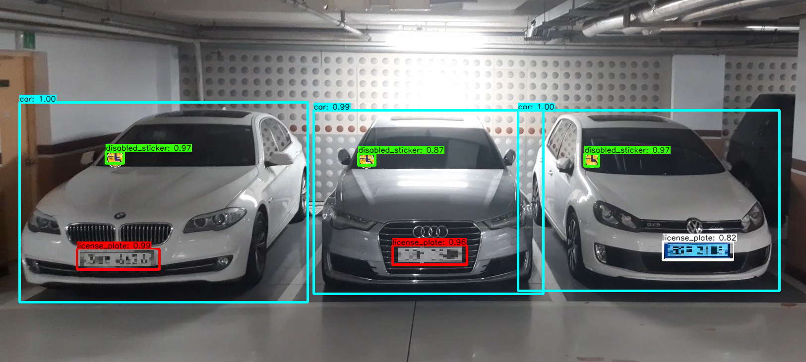
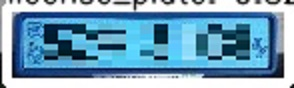
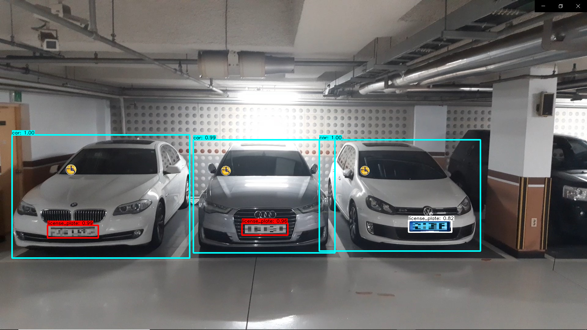
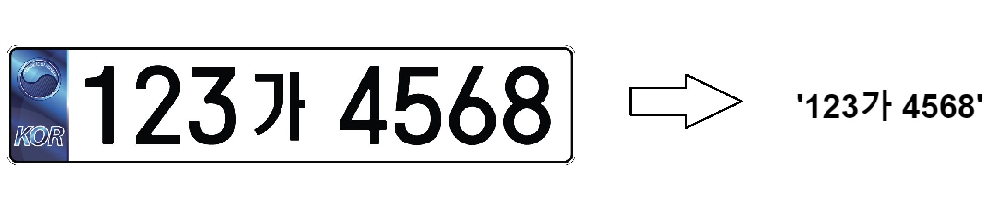

**Korean car license plate recognition using LPRNet**
-----------------------------------------------------
[Jaehwan Lee](https://github.com/jhlee508), [GilHan Park](https://github.com/RoadoneP)

If you have any errors or questions, please contact a01152a@gmail.com

Detection
---------

This repository is based on [tensorflow-yolov4-tflite](https://github.com/hunglc007/tensorflow-yolov4-tflite).

<center>  </center>

LPRnet
------

This repository is based on the paper [LPRNet: License Plate Recognition via Deep Neural Networks](https://arxiv.org/pdf/1806.10447.pdf).

We use the [KarPlate Dataset](http://pr.gachon.ac.kr/ALPR.html) for training and test model

Getting Started
---------------

### Conda (Recommended)

```
# Tensorflow CPU
conda env create -f conda-cpu.yml
conda activate yolov4-cpu

# Tensorflow GPU
conda env create -f conda-gpu.yml
conda activate yolov4-gpu
```

### Pip

```
# TensorFlow CPU
pip install -r requirements.txt

# TensorFlow GPU
pip install -r requirements-gpu.txt
```

Using Custom Trained YOLOv4 Weights
-----------------------------------

Copy and paste your custom .weights file into the 'data' folder and copy and paste your custom .names into the 'data/classes/' folder.

The only change within the code you need to make in order for your custom model to work is on line 14 of 'core/config.py' file. Update the code to point at your custom .names file as seen below. (my custom .names file is called custom.names but yours might be named differently)

Custom YOLOv4 Using Tensorflow (tf, .pb model)
----------------------------------------------

To implement YOLOv4 using TensorFlow, first we convert the .weights into the corresponding TensorFlow model files and then run the model.

```
# Convert darknet weights to tensorflow
## yolov4
python save_model.py --weights ./data/yolov4.weights --output ./checkpoints/yolov4-416 --input_size 416 --model yolov4

# Run yolov4 tensorflow model
python detect.py --weights ./checkpoints/yolov4-416 --size 416 --model yolov4 --images ./data/images/Parking_loc.jpg

# Run yolov4 tensorflow model for LPR
python detect.py --weights ./checkpoints/yolov4-416 --size 416 --model yolov4 --images ./data/images/Parking_loc.jpg --lpr

# default
python detect.py --image ./data/images/Parking_loc.jpg
```

Convert to tflite
---------------------------------------------

Since we use an embedded device (Jetson Nano) for the project, we convert it to TFlite and use it.

TFlite Advantages
- Latency: There is no round-trip to the server.
- Connection: No internet connection required
- Good for use on devices.

```
# Save tf model for tflite converting
python save_model.py --weights ./data/yolov4.weights --output ./checkpoints/yolov4-416 --input_size 416 --model yolov4 --framework tflite

# yolov4
python convert_tflite.py --weights ./checkpoints/yolov4-416 --output ./checkpoints/yolov4-416.tflite

# detect.
python detect_simple.py
```

**Custom YOLOv4 Model Example**



#### classes
- car
- license_plate
- disabled_sticker

Custom Functions and Flags
--------------------------

### Crop Detections and Save Them as New Images

I have created a custom function within the file core/functions.py that can be applied to any detect.py or detect_video.py commands in order to crop the YOLOv4 detections and save them each as their own new image. To crop detections all you need to do is add the --crop flag to any command. The resulting cropped images will be saved within the **detections/crop/** folder.

Here is an example of one of the resulting cropped detections from the above command.<center>  </center>

### Electric Vehicle Recognition

I have created a custom function within the file core/functions.py that can be applied to any detect.py or detect_video.py commands in order to detect electric vehicle by using the **<span style="color:blue">"blue license plate"</span>** characteristic of an electric vehicle.

For ease of viewing, the license plate of the electric vehicle is painted white in the color of the Bounding Box.<center>  </center>

### License Plate Recognition Using LPRnet

Tensorflow implementation of LPRnet. A lightweight deep network for number plate recognition.

-	multiple scale CNN features
-	CTC for variable length chars
-	no RNN layers

### LPRnet architecture

The basic building block of the model backbone was inspired by SqueezeNet Fire Blocks and Inception Blocks. The input image size is set as 94x24 pixels RGB image. The image is preprocessed by the Spatial Transformer Layer to allow better characteristics. The converted RGB image goes through the backbone and the intermediate feature maps from backbone subnet outputs are utiltized to capture important characteristics instead of using LSTM. The intermediate feature maps are augmented with the global context embedding and concatenated together. In order to adjust the depth of feature map to the character class number, additional 1x1 convolution is applied. The model output and the target character sequence lengths are of different length. Here we use length of 18 as output, for each output character, there are 68 different classes resulting from the CHARS.



**Dependencies**
----------------

-	Python 3.6+
-	Tensorflow 2.3.0rc0
-	Opencv 4
-	tqdm
-	editdistance

References
----------

-	Paper
	-	[LPRNet: License Plate Recognition via Deep Neural Networks](https://arxiv.org/pdf/1806.10447.pdf).
	-	YOLOv4: Optimal Speed and Accuracy of Object Detection[YOLOv4](https://arxiv.org/abs/2004.10934)
-	Dataset

	-	[KarPlate Dataset](http://pr.gachon.ac.kr/ALPR.html) <span style="color:red"> (Curreuntly, It can not be downloaded due to legal problem.)</span>
	-	Yolov4 weights : [Dodant/ANPR-with-Yolov4](https://github.com/Dodant/ANPR-with-Yolov4)

-	[darknet](https://github.com/AlexeyAB/darknet)

Huge shoutout goes to hunglc007 for creating the backbone of this repository - [tensorflow-yolov4-tflite](https://github.com/hunglc007/tensorflow-yolov4-tflite)
